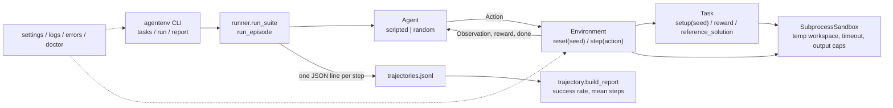

Forked from https://github.com/SWE-agent/mini-swe-agent.

# AgentEnv

A gym-style environment for tool-using LLM agents with verifiable rewards.
`reset(seed)` hands an agent a seeded task inside a fresh sandbox workspace, `step(action)`
runs one tool call (`shell`, `read_file`, `write_file` or `python`) and returns an
observation, a reward in `[0, 1]` from the task's reward function and a `done` flag, and
every step is appended to a JSONL trajectory. Built for a laptop: no GPU, no API key, no
network, deterministic episodes.

Upstream mini-swe-agent (MIT) ships unchanged in `src/minisweagent`; all fork work is in
`src/agentenv` and `tests/agentenv`.

## What I built on top

Cross-checked against `git log --author=vipul21435@iiitd.ac.in --oneline`.

- Fork baseline and tooling: Python 3.12 with a committed `uv.lock`, ruff lint and format,
  strict mypy for the new package, pytest with coverage and xdist, pre-commit, a Makefile,
  `.env.example`, and one offline GitHub Actions workflow (`checks` and `docker` jobs)
  replacing upstream's secret-dependent workflows. Hosted services (Portkey, Modal,
  Contree, SWE-ReX) moved behind optional extras so the default install is offline.
- `agentenv` package foundation: typed settings (`pydantic-settings`, `AGENTENV_` prefix,
  `.env`, secrets masked), an error hierarchy with stable codes, structured text/JSON
  logging, a docker probe and the `agentenv version | doctor | settings` commands.
- Environment core: `agentenv.sandbox` (per-episode temp workspace, bash/python
  subprocesses with a wall-clock timeout, output caps and path confinement),
  `agentenv.actions` (discriminated union of the four action kinds), `agentenv.env`
  (`Environment.reset` / `Environment.step`, graded after every step, ends on reward 1.0
  or `max_steps`), `agentenv.tasks` (pydantic `Task` model and three original seeded
  tasks with reference solutions).
- Agents, trajectories and CLI: `ScriptedAgent` (replays the reference solution) and
  `RandomAgent` (seeded random actions), a flushed JSONL `TrajectoryWriter`, a reader with
  line-numbered errors, a per-(task, agent) report, `run_episode` / `run_suite`, and
  `agentenv tasks | run | report`.
- `make demo`, a digest-pinned non-root `Dockerfile`, `docker-compose.yml` (no network,
  CPU and memory limits) and this README.

## Architecture



## Quickstart

Five commands from a fresh clone (Python 3.12 and `uv` installed, no network needed after
`uv sync`):

```bash
git clone https://github.com/vipul21435/agentenv.git && cd agentenv
uv sync --group dev
make demo
uv run agentenv report trajectories.jsonl
make ci
```

`make demo` runs the scripted and random agents over every task for 3 seeds, writes
`trajectories.jsonl` and prints the success-rate table. `make ci` is what GitHub Actions
runs: ruff, ruff format check, mypy, pytest with coverage.

With Docker: `docker build -t agentenv:dev . && docker run --rm --network=none agentenv:dev`
runs the same demo as a non-root user inside `python:3.12-slim`, or `docker compose run --rm demo`.

## CLI reference

| Command | What it does |
| --- | --- |
| `agentenv tasks` | List the built-in tasks with `max_steps` and a one-line description. |
| `agentenv run --task <id,id\|all> --agent scripted --agent random --episodes N --seed S --out FILE` | Run every named agent on every selected task for `N` episodes (seeds `S`..`S+N-1`), write one JSON line per step to `FILE` and print the report. Default: `all`, `scripted`, 1 episode, seed 0, `trajectories.jsonl`. |
| `agentenv report FILE [--json]` | Success rate, mean steps and mean final reward per (task, agent). |
| `agentenv doctor [--json]` | Toolchain report: python, docker, sandbox backend, model provider; exit 1 on problems. |
| `agentenv settings` | Effective settings as JSON with secrets masked. |
| `agentenv version` | Version string. |

Exit codes: 0 ok, 1 doctor found problems, 2 invalid configuration or arguments (the
error is printed as JSON with a stable `code`).

## Python API

```python
from agentenv.agents import ScriptedAgent
from agentenv.env import Environment, PythonAction, ShellAction
from agentenv.runner import run_episode
from agentenv.tasks import get_task

with Environment(get_task("parse_log")) as env:
    obs = env.reset(seed=3)  # Observation: task description + workspace listing
    result = env.step(ShellAction(command="head -n 2 app.log"))
    print(result.observation.output, result.reward, result.done)
    result = env.step(PythonAction(code="print(sum(1 for _ in open('app.log')))"))
    summary = run_episode(env, ScriptedAgent(), seed=3)  # EpisodeSummary(success=True, steps=1, ...)
```

- `Environment(task, limits=SandboxLimits(timeout_seconds=10, max_output_chars=4000), workspace_root=None)`
- `Environment.reset(seed) -> Observation(task_id, seed, step, output, description)`
- `Environment.step(action) -> StepResult(observation, reward, done, info)`; `info` carries
  the action kind, its duration and any sandbox error code.
- Actions: `ShellAction(command)`, `ReadFileAction(path)`, `WriteFileAction(path, content)`,
  `PythonAction(code)`; `parse_action(dict)` validates JSON input.
- `Task(id, description, max_steps, setup, reward, reference_solution)`; `get_task(id)`,
  `list_tasks()`.

### Built-in tasks

| id | Seeded setup | Reward |
| --- | --- | --- |
| `fix_checksum` | `mathlib.py` with a buggy `weighted_checksum` (seeded modulus and one of three bug variants), `TASK.md` with the spec and two worked examples | 1.0 when five hidden seeded test cases pass in a subprocess, else 0.0 |
| `summarize_numbers` | `numbers.txt` with 20-40 seeded integers | share of `count`, `sum`, `min`, `max`, `mean` in `stats.json` that match (mean within 1e-3) |
| `parse_log` | `app.log` with 30-60 seeded `<timestamp> <LEVEL> <service>: <message>` lines | share of `lines`, `by_level`, `services`, `errors_by_service` in `summary.json` that match |

Every task is checked in `tests/agentenv/test_tasks.py` on four seeds: the reference
solution scores 1.0, the untouched workspace scores 0.0, and setup is byte-identical for
the same seed and different across seeds.

### Trajectory format

One JSON object per line:

```json
{"task_id": "parse_log", "seed": 0, "agent": "random", "episode": 0, "step": 1,
 "action": {"kind": "shell", "command": "ls -la"}, "observation_excerpt": "total 16\n...",
 "reward": 0.0, "done": false, "info": {"action": "shell", "max_steps": 6, "duration_seconds": 0.0043}}
```

## Sample output

`make demo` on this machine:

```
task                 agent      episodes  success mean_steps mean_reward
------------------------------------------------------------------------
fix_checksum         random            3       0%       6.00       0.000
fix_checksum         scripted          3     100%       1.00       1.000
parse_log            random            3       0%       6.00       0.000
parse_log            scripted          3     100%       1.00       1.000
summarize_numbers    random            3       0%       6.00       0.000
summarize_numbers    scripted          3     100%       1.00       1.000
18 episodes, 63 steps
wrote trajectories.jsonl (0.87s of episodes, 0.049s per episode)
```

## Benchmarks

Measured on 2026-09-29 on an Apple Silicon Mac (Apple M2, 8 cores, 8 GB RAM), Python
3.12 via uv, subprocess sandbox, no network. Command:

```
uv run agentenv run --task all --agent scripted --agent random --episodes 10 --seed 0 --out bench.jsonl
```

| task | agent | episodes | success | mean steps | mean action time |
| --- | --- | --- | --- | --- | --- |
| fix_checksum | scripted | 10 | 100% | 1.0 | 0.000 s (write_file) |
| fix_checksum | random | 10 | 0% | 6.0 | 0.006 s |
| parse_log | scripted | 10 | 100% | 1.0 | 0.021 s (python) |
| parse_log | random | 10 | 0% | 6.0 | 0.004 s |
| summarize_numbers | scripted | 10 | 100% | 1.0 | 0.021 s (python) |
| summarize_numbers | random | 10 | 0% | 6.0 | 0.005 s |

60 episodes and 210 steps in 2.68 s of episode time (0.045 s per episode including the
reward check after every step); 2.96 s wall clock including interpreter start-up.
`make demo` (18 episodes, four `uv run` invocations) takes 2.2 s wall clock. The test
suite (`make ci`, upstream and fork tests, 8 workers) takes about 70 s.

## Design decisions and tradeoffs

- Grade after every step, not only at the end. Rewards are cheap here (a JSON compare or
  one subprocess), and a per-step reward lets an RL trainer see partial credit and lets
  the episode stop the moment the task is solved. Tradeoff: tasks with expensive graders
  would need a `grade_every` knob.
- Subprocess sandbox first. It isolates state (fresh directory per episode, minimal
  environment, timeout, output caps, path confinement) but not the host: a command can
  read the host file system or reach the network. That is acceptable for the scripted
  and random agents and keeps the suite runnable in CI without a daemon; the Docker
  backend with `--network=none` and resource limits is the next step, and
  `Settings.sandbox_backend` already exists for it.
- Reference solutions are part of the task. They double as the scripted baseline, the
  test that proves every reward function is satisfiable, and the ceiling to compare
  agents against. The random agent is the floor: it must score 0 on every task, which
  guards against reward functions that are too easy.
- Seeds derive parameters with `random.Random(f"{task_id}:{seed}")`, so the same seed
  gives byte-identical workspaces across processes and machines, and tasks never share a
  random stream.
- Partial credit where it is meaningful (share of matching keys for the JSON tasks),
  binary for hidden tests. The environment clamps rewards to `[0, 1]`.
- Errors inside an action (path escape, missing file) become observations with
  `returncode 1` and an `info["error"]` code instead of exceptions, because an agent
  should see its mistakes; protocol errors (`step()` before `reset()`) raise
  `EpisodeError`.
- Upstream is untouched. mini-swe-agent's executors and agent loop are the base for the
  Docker sandbox and the LLM agent; keeping the package unchanged keeps its 600 tests as a
  regression suite and makes upstream merges cheap.

## Layout

```
src/minisweagent/   upstream mini-swe-agent (unchanged apart from ruff formatting)
src/agentenv/       actions, agents, cli, doctor, env, errors, logs, runner, sandbox, settings, tasks, trajectory
tests/agentenv/     fork tests (unit, CLI, subprocess integration)
tests/...           upstream test suite (kept green)
Dockerfile, docker-compose.yml, Makefile, .github/workflows/ci.yml
```

## What I would do next

1. Docker sandbox backend on the upstream executor: `--network=none`, CPU, memory and
   pids limits, read-only root with a writable workspace mount.
2. A 10+ task suite with a validator that checks every task the way the tests do now
   (reference 1.0, empty 0.0, determinism) and reports task difficulty from the random
   floor.
3. An OpenAI-compatible LLM agent that emits `parse_action` JSON, using the existing
   `AGENTENV_MODEL_PROVIDER` / `OPENAI_BASE_URL` settings so a local server works.
4. A FastAPI service exposing `reset` / `step` over HTTP for remote trainers.
5. Richer reports: per-step reward curves, action-kind histograms, failure taxonomies.

## License

MIT. The upstream copyright notice is kept in `LICENSE.md`; new code is
Copyright 2026 Vipul Raj Jha under the same license.
